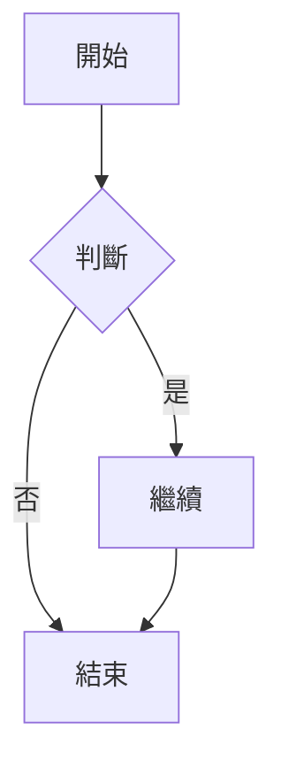

# md2doc 範例文檔

這是一個測試 md2doc 轉換功能的範例文件。

## 功能特點

md2doc 支援以下功能：

- **Markdown 解析**：完整的 GFM 支援
- **格式轉換**：支援 Word 和 PDF 格式
- **主題系統**：5 個預設主題可選
- **Mermaid 圖表**：本地離線渲染

### 代碼範例

這是一個 JavaScript 代碼範例：

```javascript
function hello() {
  console.log("Hello, World!");
}
```

### 表格支援

| 功能 | 狀態 | 說明 |
|------|------|------|
| Markdown 解析 | ✅ | 完成 |
| Word 轉換 | ✅ | 完成 |
| PDF 轉換 | 🚧 | 進行中 |

### 引用

> 這是一個引用區塊。
> 可以包含多行文字。

### Mermaid 圖表



## 結論

md2doc 是一個強大的 Markdown 轉換工具！

---

**感謝使用 md2doc！**
